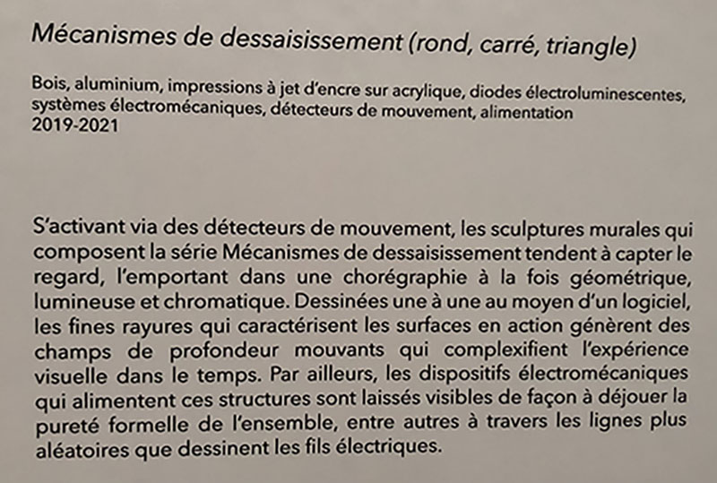
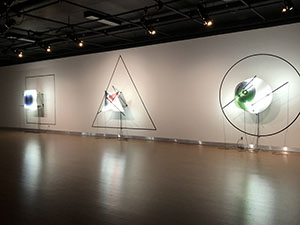
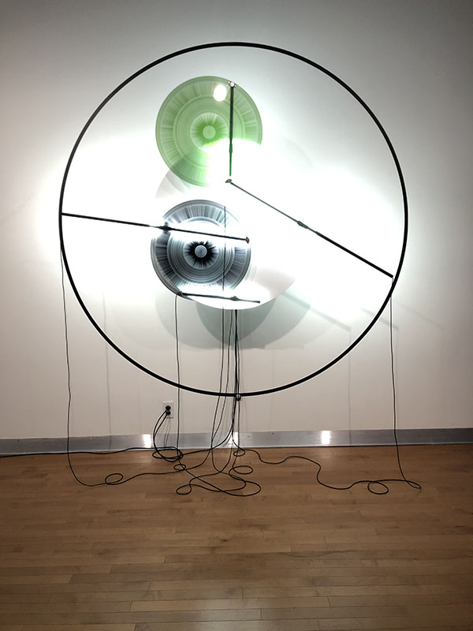
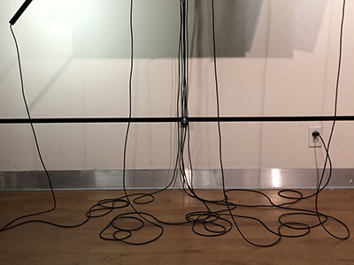
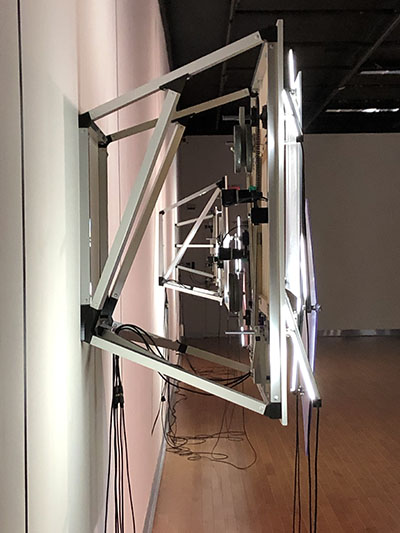

### 1. Titre de l'oeuvre ou de la réalisation :

*Rond, Triangle, Carré*

### 2. Nom de l'artiste ou de la firme :

Aseman Sabet

### 3. Année de réalisation :

2019-2021

### 4. Nom de l'exposition ou de l'événement :

L'oeuvre était présentée dans le cadre de l'exposition *Béchard Hudon*.

### 5. Lieu de mise en exposition :

L'oeuvre a été mise en exposition dans la salle Alfred-Pellan.

### 6. Date de votre visite : 

16 mars 2022

### 7. Description de l'oeuvre ou du dispositif multimédia (à composer ou reprendre la description offerte sur le site de l'artiste ou le cartel de l'exposition en citant bien sa source) : 

"S'activant via des détecteurs de mouvement, les sculptures murales qui composent la série *Mécanismes de dessaisissement* tendent à capter le regard, l'emportant dans une chorégraphie à la fois géométrique, lumineuse et chromatique. Dessinées une à une à moyen d'un logiciel, les fines rayures qui caractérisent les surfaces en action génèrent des champs de profondeur mouvants qui complexifient l'expérience visuelle dans le temps. Par ailleurs, les dispositifs électromécaniques qui alimentent ces structures sont laissés visible de façon à déjouer la pureté formelle de l'ensemble, entre autres à travers les lignes plus aléatoires que dessinent les fils électriques."

(Ce texte est tiré du cartel présent à côté de l'oeuvre *Rond, Triangle, Carré). 

### 8. Explications sur la mise en espace de l'oeuvre ou du dispositif (texte à composer) : 

L'oeuvre prend la largeur d'un mur au complet et est composé de trois dispositifs : un en forme de triangle, un en forme de rond et l'autre en forme de carré. À chaque dispositif, le concept se répètent. Autour de chaque oeuvre se trouve une forme géométrique dessiné en grand et en noir avec la forme qui correspond à l'oeuvre en question. Ces formes tracées au mur donne un aspect de grandeur à l’œuvre et donne donc plus de volume et plus de présence à l'oeuvre dans la salle. De plus, ça ajoute une certaine profondeur. L'artiste trouvait ça important d’avoir plusieurs plans dans ces œuvres et c'est donc pour ça que ces formes sont tracées au mur. Pour ce qui est du fonctionnement de l'oeuvre, c'est assez simple. L'installation constituée de formes géométriques n'est pas collé au mur grâce aux barres de métal qui la sépare de celui-ci. C'est deux mêmes formes géométriques de couleur différentes et faites d'acrylique qui tournent sur un fond blanc dans une durée de 35min à une heure à l'aide de petites tiges qui sont reliées à une prise d'alimentation. D'ailleurs, le fait que les fils soient exposés est loin d'être le fruit du hasard. Ils permettent de montrer qu’il y a une mécanique de mouvement et ça rajoute quelque chose au concept de l'oeuvre. Au bout d'un moment, les deux formes vont finir par se croiser ce qui créé un autre mouvement en plein centre.

Cependant, il n'y a pas réellement un mouvement qui se passe au centre. Les lignes dessinées à la main à l'ordinateur à l'aide d'un logiciel permet de produire une géométrie perceptuelle, c'est-à-dire une illusion d’optique qui pousse notre cerveau à voir un autre mouvement. Pour ce qui est de la lumière, l'artiste a changé la gélatine de l’éclairage pour de la gélatine bleuté pour créer un éclairage plus froid et ainsi apporter une précision et rendre l’œuvre plus vivante en mettant le jeu des bras mécaniques en valeur. De plus, pour économiser de l'énergie, des détecteur de mouvement sont placés devant chacune des sculptures pour économiser de l’énergie et ainsi pouvoir laisser le mécanisme se reposer lorsqu'il n'y a pas de public. Il n'y pas réellement de système de son dans cette oeuvre étant donné qu'elle utilise le son de l'oeuvre à côté. 

### 9. Liste des composantes qui constituent l'oeuvre :

- Projecteurs de lumière 
- Gélatine bleu 
- Formes d'acrylique 
- Tiges mécaniques
- Fils d'alimentation
- Détecteurs de mouvement 

- Barres de métal pour accrocher l'oeuvre 

### 11. Expérience vécue :

Mon expérience de l'oeuvre était assez banale étant donné que je ne pouvais pas réellement intéragir avec l'oeuvre. La seule chose qui m'as réeellement fait vivre quelque chose était le moment où les deux formes se croisaient et l'illusion d'optique se mettait à apparaitre. C'était tellement apaisant à regarder, encore plus avec le son qui provenait de l'installation juste à côté. 

Le concept que j'aimerais reprendre serait celui de la profondeur mise en avant par l'artiste. Je trouve qu'elle a été bien réussie et qu'elle ajoutait réellement de la présence à l'oeuvre. Sans cette petite touche, les oeuvres auraient parues très petites comparées aux autres qui étaient plus grosses. C'est une idée que j'aimerais reprendre à l'avenir.

Cependant, je n'ai pas réellement aimé le fait que les fils soient apparents ou que la durée de rotation soient aussi lente. Ça peut devenir rapidement ennuyeux pour quelqu'un d'impatient et ce n'est pas quelque chose que j'aimerais reprendre dans mes oeuvres futures.
 

 ### 12. Références :
 
 - https://bechardhudon.com/
 
