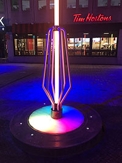
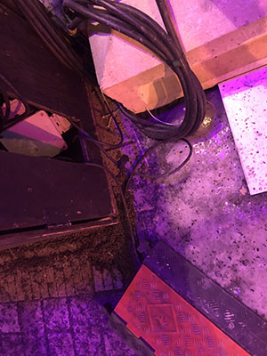

### 1. Titre de l'oeuvre ou de la réalisation :

*Roseaux*

### 2. Nom de l'artiste ou de la firme :

- Direction artistique et création : ITOMN 
- Conception sonore et lumière : UDO DESIGN et Serge Maheu 
- Conception de programmation intéractive : Serge Maheu 
- Producteur de tournée : CREOS

### 3. Année de réalisation :

2021-2022

### 4. Nom de l'exposition ou de l'événement :

L'exposition s'appelle *Luminothérapie*. D'ailleurs, c'est la 12e édition qui a été présentée dans le cadre de l'évènement *Montréal en lumière*

### 5. Lieu de mise en exposition :

Quartier des spectacles à Montréal

### 6. Date de ma visite : 

16 février 2022 

### 7. Description de l'oeuvre ou du dispositif multimédia :

"Bouger n'aura jamais été aussi amusant qu'avec *Roseaux*, une installation "participative" et interactive. Composée de tiges individuelles qui s'élèvent dans le ciel, l'installation *Roseaux* invite le public à activer les bases en tapant du pied sur les boutons senseurs, insufflant des rythmes colorés qui voyagent jusqu'au sommet des tiges.

Seul ou à plusieurs, on s'active dans une course effervescente et ludique dans le but d'illuminer la tige d'une couleur unique. À la parade visuelle s'ajoute une trame sonore vibrante et parfaitement synchroniséee aux flux lumineux, offrant une expérience sensorielle énergisante. En mode veille, de légères pulsations lumineuses et sonores lancent un appel à l'activation tout en animant l'espace de façon poétique."

(Ce texte est tiré de la page Web dédié à l'oeuvre *Roseaux* sur le site de *Montréal en lumière*)

### 8. Explications sur la mise en espace de l'oeuvre ou du dispositif : 

L'oeuvre *Roseaux* se trouve dans un terrain assez large et se déroule à l'extérieur dans le cadre de l'évènement Montréal en lumière. Voilà un petit schéma du lieu pour situer un peu plus sa position

(Ce schéma est tiré du site Web dédié à l'exposition *Luminothérapie* sur le site de *Montréal en lumière*)

Les différentes tiges étaient situées à distances équivalentes l'une de l'autre tout en se laissant assez d'espace pour permettre aux différents groupes d'utiliser chacun une tige de l'exposition. Elle est entourée de bâtiments divers et se trouve en plein centre de la rue pavée qui sépare les bâtiments de gauche de ceux de droite. Pour ce qui est du dispositif, son physique est assez simple. Il s'agit d'une tige lumieuse qui s'élève vers le ciel avec un socle circulaire noir et un dessus aussi lumineux que la tige elle-même. Lorsque l'utilisateur frappe les petits boutons présents sur la base, une musique commence et s'accélère au fur et à mesure que les pas s'accélèrent aussi. Plus l'utilisateur frappent rapidement du pied, plus une lumière qui correspond à celle du côté de l'utilisateur montera dans la tige jusqu'à la recouvrir entièrement. Le gagnant est celui qui arrive à faire dominer sa couleur dans la tige. Voilà à quoi ressemble l'ensemble de l'installation :

### 9. Liste des composantes qui constituent l'oeuvre :

- Bâton lumineux 
- Socle lumineux 
- Tiges de métal 

- Fils 
- Cache-fils 

- Tapis en caoutchouc 
- Haut-parleur intégré à la base 

### 11. Expérience vécue :
 
Mon expérience de l'oeuvre a assez été mitigée au début. En effet, je ne comprenais pas vraiment comment utiliser le dispositif et ce n'est qu'au bout de quelques essais que j'ai fini par comprendre comment ça marchait. Après avoir réellement compris comment l'utiliser, l'expérience était plutôt amusante et j'ai eu beaucoup de plaisir à rentrer en compétition avec mes deux amies qui étaient présentes avec moi. Chacune voulait tenter de gagner et ça occasionnait beaucoup de fous rires. En bref, j'ai vraiment adoré essayer l'oeuvre *Roseaux* et encore plus avec mes amies.

Ce qui m'as plu dans cette oeuvre, c'était surtout son aspect physique qui était assez moderne et qui s'accordait bien avec l'ambiance dans lequel elle était présentée. Lorsque je pense à Montréal, je pense automatiquement à centre-ville et beaucoup de lumière un peu partout autour de moi et *Roseaux* représentait un peu ça à mon avis. *Roseaux* était pour moi des tiges de lumières qui illuminaient la place comme des édifices au centre-ville de Montréal. En bref, leur concept physique s'accordait bien avec leur lieu d'exposition et c'est une caractéristique que j'aimerais garder en tête à l'avenir.

Pour ce qui est du négatif, il n'y a pas grand chose que je n'ai pas aimé sur cette oeuvre. La seule chose que je pourrais notifier serait son entretien mal fait étant donné que la plupart des bases sont sales, mais ce genre de chose est prévisible lorsqu'on parle d'oeuvre participative et encore plus celles à l'extérieur. À mon sens, je suis quelqu'un d'assez maniaque et la propreté est quelque chose d'impoprtant et j'aurais donné comme instruction d'au moins nettoyer les contours du socle. Sinon, je ne trouve pas d'autres côtés négatifs à l'oeuvre que je n'aimerais pas reproduire dans mes prochaines réalisations.
 
 ### 12. Références :
 
- https://sergemaheu.com/?portfolio=roseaux
- https://www.montrealenlumiere.com/SiteExterieur/OeuvresLumineuses
- https://www.mtl.org/fr/experience/luminotherapie

### 13. Croquis :
