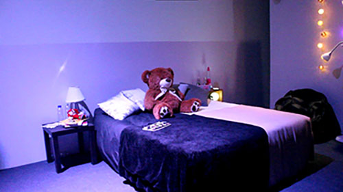
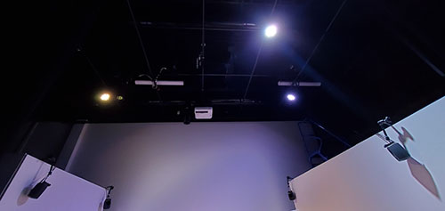

### 1. Titre de l'oeuvre ou de la réalisation :

*Chère Sasha*

### 2. Nom de l'artiste ou de la firme :

- Trish Nguyen
- Angelina De Silva Jeca
- Karine Cormier
- Sabrina Kayani

### 3. Année de réalisation :

2021-2022

### 4. Nom de l'exposition ou de l'événement :

L'oeuvre a été présentée dans le cadre de l'évènement *Moebius* au collège Montmorency.

### 5. Lieu de mise en exposition :

Le grand studio (C-1712) au collège Montmorency.

### 6. Date de votre visite : 

 23 mars 2022

### 7. Description de l'oeuvre ou du dispositif multimédia (à composer ou reprendre la description offerte sur le site de l'artiste ou le cartel de l'exposition en citant bien sa source) : 

"Sasha adolescente et Sasha adulte vivent leur vie. Durant son adolescence, Sasha se fait négliger par ses parents et cela affecte sa santé mentale. Pendant sa vie d'adulte, Sasha habite maintenant seule, Sasha s'accepte, mais ses parents sont toujours contre elle. Cependant, Sasha se porte mieux mentalement qu'avant. Le public est appelé à découvrir que les deux vies projetées devant eux sont différents passages de la vie d'une seule et même personne."

(Cette description provient du site TIM dédié au projet de *Chère Sasha*)

### 8. Explications sur la mise en espace de l'oeuvre ou du dispositif : 

Avant de vous expliquer la mise en place de l'oeuvre *Chère Sasha*, voilà un petit schéma fourni par l'équipe afin de visualiser un peu mieux l'espace : 

(Ce schéma de plantation vient du GitHub dédié à l'oeuvre *Chère Sasha*)

L'installation est composée d’une pièce divisée en deux dont le lit qui se présente comme étant l'objet central de celle-ci. La partie illuminée de la pièce représente la vie adulte de Sasha tandis que, la partie sombre sa vie d'adolescente. Chaque espace contient des objets qui correspondent à l'ambiance de l'époque spécifiée comme des journaux intimes écrits à la main, des manuels ou encore des téléphones. De plus, sur le côté de la chambre qui correspond à l'adolescence de Sasha, il y avait également des posters qui ont été dessinés par les membres de l'équipe elle-même. Au centre de la pièce, un projecteur était accroché au plafond afin d'afficher des vidéos en lien avec l'exposition ainsi que les nombreux messages d'encouragement laissés à Sasha par les utilisateurs après leur visite. D'ailleurs, l'ordinateur servant à cette usage se trouvait dans le coin au fond à droite. Durant toute l'expérience, une petite musique accompagnée de certaines paroles de Sasha était jouée comme trame de fond grâce aux quatre haut-parleurs placés sur les murs. Il y en avait deux du côté gauche ainsi que deux du côté droit. Pour la lumière, l'équipe a utilisé des guirlandes de lumière accrochées du côté droit de l'installation ainsi que deux types de projecteurs situés dans les herses en plus des petites lampes de chevet. 

### 9. Liste des composantes qui constituent l'oeuvre :

- Projecteur 
- Haut-parleurs 

- Un ordinateur
- Un lit 
- Divers objets de décoration (journal, posters, téléphone, etc.) 
- Plusieurs lampes pour l'éclairage

### 11. Expérience vécue :

J'ai adoré mon expérience de l'oeuvre *Chère Sasha* autant pour le niveau sonore que visuel. Le fait que ce soit les membres de l'équipe elle-même qui ont pris la peine de dessiner les posters et d'écrire les deux journaux intimes à la main m'as absoluement fasciné. On voyait clairement le nombre d'heures qui a été fournie pour les moindres détails présents et c'était quelque chose qu'on pouvait facilement qualifier d'admirable. L'ajout du téléphone qui reçevait des notifications ou des appels aux moments idéals rajoutait du réalisme à l'expérience et j'ai adoré ça. De plus, l'idée de pouvoir voir tous les messages que le public avant moi avait laissé était une idée originale et elle ajoutait une touche créative à l'expérience.

Ce que je reprendrais de cette oeuvre, c'est sans aucun doute son côté créatif. La manière dont est abordé la sexualité est particulièrement intéressante et je trouve leur approche artistique inspirante pour mes futurs projets à venir. De plus, le message est passé très clairement et c'est aussi ce que je voudrais reproduire avec mes oeuvres.

Pour être honnête, je ne trouve aucun point négatif à cette oeuvre. L'organisation était bien présente et le résultat incroyable en témoigne. Le nombre de détails mis dans cette oeuvre en témoigne et il n'y a rien que j'ai pu considérer comme quelque chose de négatif et que j'aimerais éviter.
 

 ### 12. Références :
 
- https://tim-montmorency.com/2022/projets/Chere-Sasha/docs/web/index.html
- https://github.com/task-tim/Chere-Sasha

### 13. Ordre de préférence : 

1. *Chère Sasha* 

Comme mentionné précédemment, j'ai absolument adoré cette oeuvre pour son côté créatif et je trouve que tous les éléments qui y étaient présent ajoutent une touche spéciale à l'expérience. De plus, aborder le thème de la sexualité de cette manière était très approprié et faisait passer le message au public de manière très clair.

2. *L'horloge de l'apocalypse*

J'ai adoré les dessins qui allaient à chaque heure de l'horologe et les musiques qui les accompagnaient s'accordaient parfaitement. C'est un concept simple, mais très efficace qui a très bien marché et qui capte facilement l'attention du public avec le constrate marquant entre les différentes époques présentées. 

3. *Chronaufrage* 

J'ai adoré cette oeuvre principalement pour son côté visuel. Les dessins étaient très bien faits et captaient l'oeil direct en rentrant dans le grand studio. De plus, le petit ajout de la fille qui accélère quand le public s'en approche rend l'exposition encore plus intéressante.

4. *Jeu temporel* 

Le concept de base du jeu m'avait intrigué et c'était un de mes premiers choix à la base. Cependant, en y jouant, j'ai été assez déçue de voir que l'animateur ne *glitchait* pas autant qu'un des membres de l'équipe m'avait décrit lorsqu'il m'expliquait leur idée de projet. À part ça, les questions du jeu étaient bien.

5. *3 minutes* et *Distorsion collective*

Pour ces deux-là, je n'ai malheureusement pas d'avis après les avoir expérimenté vu que je n'y ai pas eu accès. Pour le premier jeu VR, *3 minutes*, lorsque nous avons voulu l'essayer, nous avons remarqué que l'équipe avait de la difficulté à faire fonctionner leur casque VR, donc on a tout simplement pas eu le temps de l'essayer après qu'il ait été réparé beaucoup plus tard. Pour ce qui est de *Distorsion collective*, il y avait à chaque fois quelqu'un qui utilisait le casque VR, donc je n'ai pas eu la chance de l'essayer non plus.
